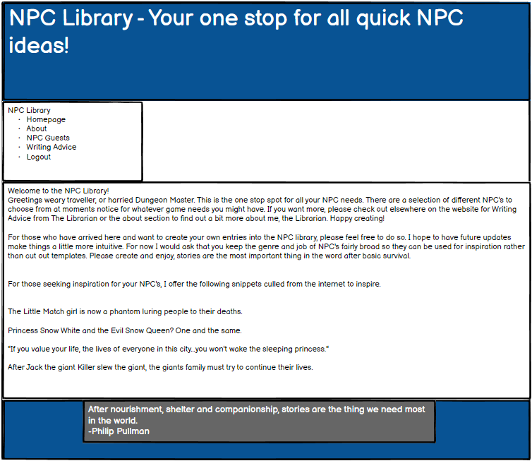
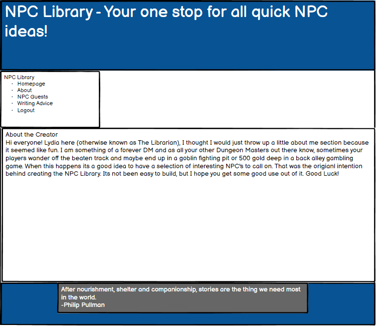
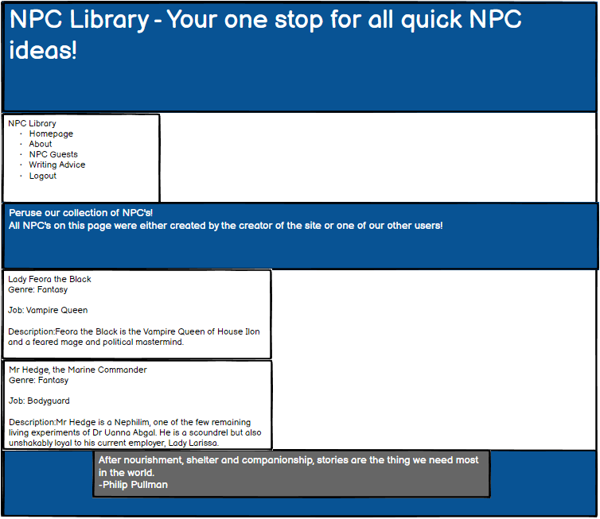
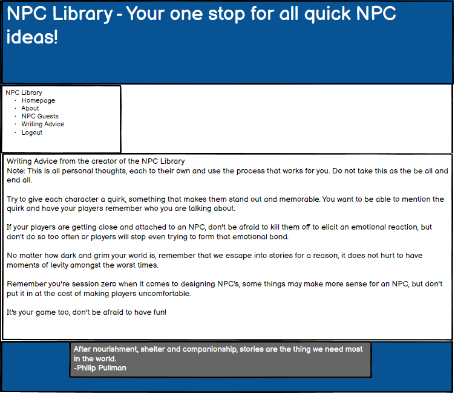
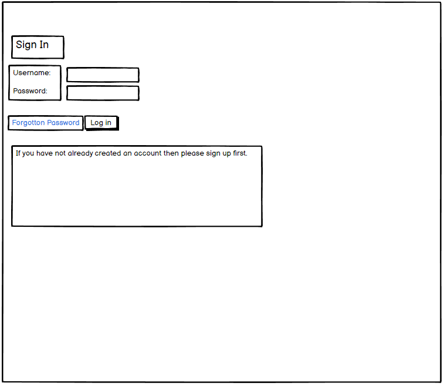
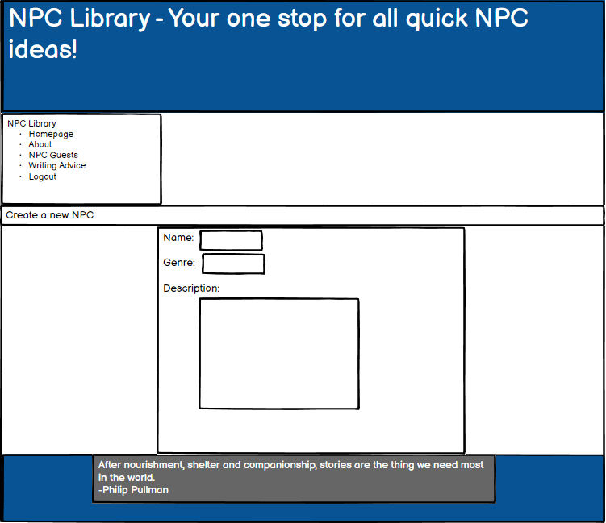

# The NPC Library

The NPC Library is a website where anyone who plays tabletop roleplaying games, creates stories or indeed runs games of LARP can 
come and create NPC's (Otherwise known as Non Player Characters) and store those created NPC's on the website for ease of finding them 
later rather than having to rely on paper notes or one of the other world building websites that can sometimes seem to offer too much.

The Live application for the NPC Library can be found here:

https://lydia-npc-library.onrender.com

# Purpose and Target Audience

# Persona and User Stories

# Wireframes and Initial Design

### Home Page

### About Page

### NPC Guests

### Writing Advice

### Log in page

### Submit an NPC page
