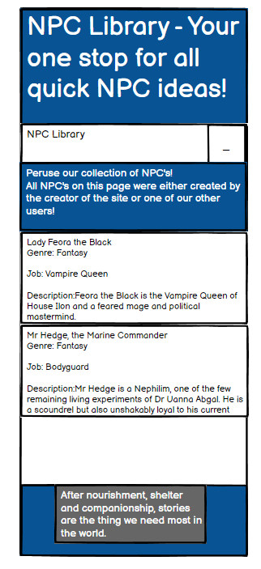
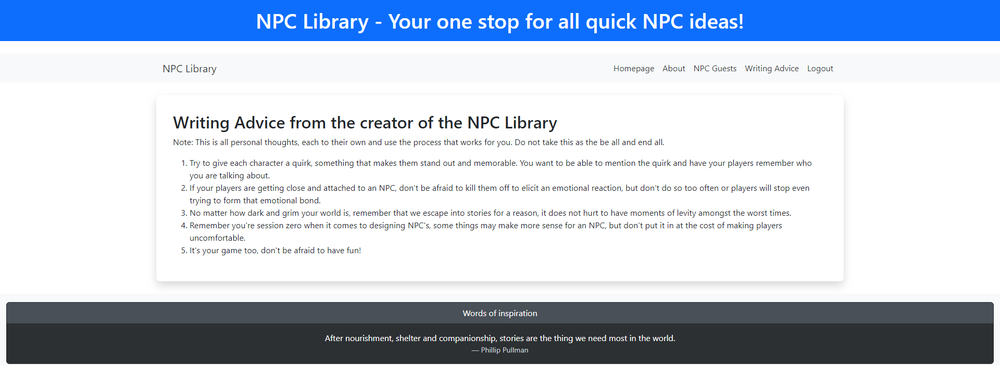

# The NPC Library

The NPC Library is a website where anyone who plays tabletop roleplaying games, creates stories or indeed runs games of LARP can 
come and create NPC's (Otherwise known as Non Player Characters) and store those created NPC's on the website for ease of finding them 
later rather than having to rely on paper notes or one of the other world building websites that can sometimes seem to offer too much.

The Live application for the NPC Library can be found here:

https://lydia-npc-library.onrender.com

# Purpose and Target Audience
### Purpose
The purpose of the NPC Library is to provide a place for Game Masters and other organisers/writers to have a place to store their created Non-Player Characters on a concise site that does not contain anything apart from the list of NPC's. Users will be able to add entry's that will allow them to keep track of their created NPC's with a name, genre, description and role.
### Target Audience
The Target audience for the NPC Library is anyone who wants to keep track of various characters, be they NPC's or other characters who may feature in works of fiction. I hope that this website will be of value to aspiring Game Masters and allow paper notes to become a thing of the past.
# Persona and User Stories
* As an admin I want to be able to delete entry's that are either inappropriate or not in use anymore. 
* As a user I want to be able to edit my entry's to update them and also delete them if they become become no longer relevant. 
* I want to be able to create an account so I can access the website and not have my entry's available to everyone.
* I want to be able to keep a list of NPC's for my use that I can look at with a glance.
* Add the ability to put a longer description in about each NPC.
* Add the ability to log into the NPC Library.
* Add a section about writing advice for both creating NPC's and wider writing.

# Wireframes and Initial Design
The navbar in the final website looks different to the navbar in the wireframes after I made some adjustments to the formatting.
### Home Page

### About Page

### NPC Guests

### Writing Advice

### Log in page

### Submit an NPC page

## Mobile Wireframes

### Sign Up

### Home Page

### About Page

### NPC Guests

### Writing Advice

### Log in page

### Create an NPC

# Agile
For this project I used the agile development method, this was not something I had done before as a solo developer so I took some time at the start of the project to try to go through and do everything properly from the start.I found by creating the Kanban board and user stroies I was able to priorotise and guide myself to fulfil the project criteria. I was able to reduce the normal amount of anxiety and stress I feel when working to a tight dealine by staying focused on one objective at a time.

# Aesthetic Choices
The colours for the website were picked to give a clean and functional look without distracting bright colours. I tried to have the colour go from lighter to darker as it went down the page.

* Header - #014181

* Text - #ffffff

* Footer - #014181

* Footer Secondary Colour - #495057 / #2c3033

* Fonts - Arial 

## Features

### Log In
The log in page allows anyone who wants to use the website to sign up or log in with a previously created account. 

### Homepage
A user must make an acount with the website before they are allowed to reach the homepage, I made this so anyone interested in the website would have the oppotunity to create entry's for their own use.

### About page
This is a page just to give some inofrmation about the creator of the website.

### Writing Advice
This is a page giving some advcie about writing NPC's for people's own use.

### NPC Guests
The NPC guests page is where users can add new NPC's as well as edit and delte their own entry's. This entry will then be visible on the NPC guest page.

# Future Plans
In the future I would like to add the following:
* Add a searchbar to make it easier to find specific NPC's.
* Add tags to each entry so they can be marked as Side Quests, Antagonists and Main plot specific NPC's.
* A central list of NPC's anyone can contribute to and can be moderated.
* A way to form a community, perhaps adding a socail media presence.
* Add a way to make comments on their entry's to mark important events.
* Add a linknig system so one NPC can link to another.
* Implement the ability to retrieve forgotton passwords

### Database Design

I created the Entity Relationship Diagram to help me visaulise how my tables relate to each other, Lucidchart proved a helpful tool in doing so.

### NPC Library Flowchart

I found the flowchat helpful in visualising what parts of the website needed to be completed in what order as well as tracking down where in the website changes I made might have run into issues.

# Validation
## HTML Validation
Register.html - Some allauth errors..

Log In

Homepage

About

NPC Guests

Create an NPC

Writing Advice

Log out

## CSS Validation

Validated using Jigsaw. (The reccomended site.)

## Python Validation
Forms.py

Settings.py

Views.py

Urls.py

Models.py

Validated using Pep8. (The reccomended site.)

# Responsiveness 
I tested the website on varying device sizes using Google Chrome's developer tools.

I have tested the website on the Google Chrome browser as well as the following sized devices:

## Galaxy Z Fold 5
Homepage

Create an NPC

NPC Guest

Sign Out Page

## Ipad Pro

Homepage

NPC Guest page

Create an NPC

Sign Out page

# Testing
## Lighthouse Audit
Homepage

About page

NPC Guests page

Writing Advice

Sign In

Create an NPC

Sign Out

# User Story Testing
* As an admin I want to be able to delete entry's that are either inappropriate or not in use anymore. 

* As a user I want to be able to edit my entry's to update them and also delete them if they become become no longer relevant.

* I want to be able to create an account so I can access the website and not have my entry's available to everyone.

* I want to be able to keep a list of NPC's for my use that I can look at with a glance.

* Add the ability to put a longer description in about each NPC.

* Add the ability to log into the NPC Library.

* Add a section about writing advice for both creating NPC's and wider writing.

* As a User I want to be able to create new NPC entry's.
 

# Links
| Link | Expected result | Pass/Fail |
| ------- | ---------------- | ----- |
| Logo | Navigates to the homepage when clicked | Pass |
| Homepage | Navigates to the homepage when clicked | Pass |
| About | Navigates to a About  page when clicked | Pass |
| NPC Guests | Navigates to NPC Guests page when clicked | Pass |
| Create an NPC | Navigates to a page allowing the user to create an NPC | Pass |
| Writing Advice | Navigates to Writing Advice when clicked | Pass |
| Sign In | Navigates to a screen where users can Sign in when clicked | Pass |
| Logout | Navigates to a page confirming for the user to log out | Pass |
| Sign Up | Navigates to a page confirming for the user to Sign up | Pass |

# Tools Used
* Python used as the back-end programming language
* Git used for version control, utilising git add, git commit and git push.
* GitHub used for secure online code storage.
* Render used to host the deployed back-end site.
* Bootstrap was used for the front end CSS to make it easier to later edit.
* Google and Stack overflow were used for research as well as talking problems over with other students on the course.
* GitHub Pages used for hosting the deployed front-end site.

# Languages Used
* HTML5
* CSS
* Python
# Known Bugs
All the known bugs in this version of the website have been resolved. Some parts of the application have been partially added but were not part of the MVP and so I focused on achieving MVP. I hope to address these areas of the website in the near future.
# Deployment
I had to use the cheat sheet provided by my facilitator for deploying the project to Render. It went fairly smoothly for the most part with a few issues in the early days.
# Credit
* I used the LMS Django blog project as the basis for this project but made some alterations whilst watching the NetNinja video going over how to make a Django blog project.
* The other members of my cohort were very helpful in dealing withseveral issues I ran into as was the coding coach.
* The Fonts were taken from google fonts
* I used some interesting prompts for characters from a Tumblr post I saw when scrolling.
* Stack Overflow was able to sometimes provide assistance with some of the issues I ran into.
* I took inspiration for my user storeis from some example sites shown to us by our facilitator
* I used Balsamiq for creating my Wireframes
* I used Lucid to create my databse diagram and website flow chart. 

